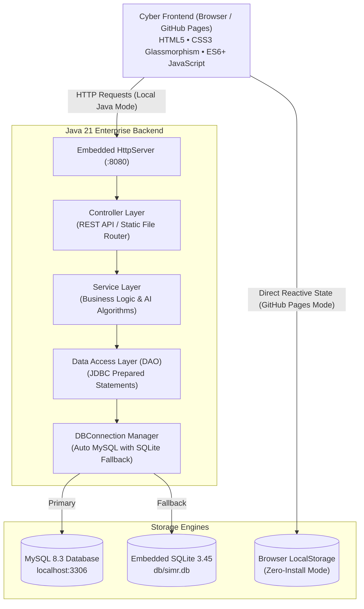

# ⚡ SIMR // CYBER — Smart Inventory, Supplier & Predictive Reorder Management Platform

<div align="center">


<br/>

### 🌐 **[👉 CLICK HERE TO OPEN LIVE INTERACTIVE APPLICATION ON GITHUB PAGES 👈](https://mottimivikaschowdary.github.io/PROGRAMMING-IN-JAVA-/)**

**Demo Access Credentials:** `admin` / `admin123` *(or click the "Auto-Fill" button on the login screen)*

</div>

---

## 📖 Executive Summary

**SIMR (Smart Inventory, Supplier and Predictive Reorder Management Platform)** is an enterprise-grade **Java Capstone Project** engineered with a robust Java 21 backend architecture (`Controller → Service → DAO → Database`), native JDBC connectivity with automatic dual-engine persistence (MySQL with seamless SQLite fallback), and an ultra-modern **Futuristic Cyber-Glassmorphic UI** interface.

The platform is designed to eliminate inventory stockouts, mitigate global supply chain lead-time shocks, visualize warehouse spatial capacity in real-time, and automate purchase order invoicing using predictive algorithms.

---

## 🌟 Core Highlights & Feature Suite

```
                               ┌────────────────────────────────────────────────┐
                               │       SIMR CYBER PLATFORM // ECOSYSTEM         │
                               └───────────────────────┬────────────────────────┘
                                                       │
         ┌─────────────────────┬───────────────────────┼───────────────────────┬─────────────────────┐
         ▼                     ▼                       ▼                       ▼                     ▼
 ┌───────────────┐     ┌───────────────┐       ┌───────────────┐       ┌───────────────┐     ┌───────────────┐
 │ Cyber UI &    │     │ A.I.V.A.      │       │ Warehouse     │       │ Predictive    │     │ Laser Barcode │
 │ Theme Engine  │     │ Voice Agent   │       │ Digital Twin  │       │ Reorder AI    │     │ Scanner HUD   │
 └───────────────┘     └───────────────┘       └───────────────┘       └───────────────┘     └───────────────┘
```

### 1. 🌌 Futuristic Cyber-Glassmorphic UI & Dual Theme Engine
* **Cyber Dark Matrix (Default):** Deep space navy background (`#070b14`), luminous glowing neon accents (Cyan `#00f2fe`, Purple `#a855f7`, Emerald `#10b981`, Rose `#f43f5e`), and high-translucency glassmorphism with backdrop blur filters.
* **Next-Gen Frost Light Mode:** Instant 1-click toggle to a clean, crisp, high-contrast luminous aesthetic suitable for well-lit lecture halls.
* **Native Web Audio SFX Synthesizer:** Pure procedural Web Audio API sound effects (sci-fi laser sweeps, UI clicks, success chimes, and critical alert buzzers) with an instant topbar mute/unmute control.
* **Live System Telemetry HUD:** Real-time heartbeat indicator displaying core runtime status (`JAVA 21 / HYBRID`), database engine, and instant alerts.

### 2. 🎙️ A.I.V.A. (Artificial Inventory Virtual Assistant)
* Integrated voice interaction suite featuring an animated acoustic soundwave visualizer.
* Natural speech recognition and spoken voice synthesis:
  * *"Show alerts"* — Navigates directly to active stockout warnings.
  * *"Open warehouse"* — Launches the Warehouse Digital Twin spatial grid.
  * *"Predictive simulation"* — Opens the AI demand simulation sandbox.
  * *"Switch theme"* — Toggles between Cyber Dark and Frost Light themes.
  * *"System status"* — Verbally summarizes total inventory valuation and health telemetry.

### 3. 🗺️ Warehouse Digital Twin // 2D Spatial Rack Matrix
* Interactive 2D spatial visualizer mapping real-world warehouse aisles, bays, and shelves:
  * **Zone A:** Electronics | **Zone B:** Networking | **Zone C:** Computing | **Zone D:** Accessories | **Zone E:** Office Supplies.
* Color-coded dynamic capacity heat map:
  * 🟢 **Optimal:** Healthy inventory capacity.
  * 🟡 **Warning:** Approaching or at reorder threshold.
  * 🔴 **Critical:** Depleted or zero stock.
* Interactive **Shelf Inspector** modal featuring 1-click **Fast Dispatch** and **Fast Restock** operations.

### 4. ⚡ Laser Barcode Scanner HUD & Label Engine
* **Interactive Scanner HUD:** Animated scanning crosshairs with a sweeping red laser line and procedural acoustic feedback.
* **Zero-Dependency Barcode & QR Generator:** Native vector SVG Code 128 barcodes and verification QR codes generated purely client-side without external dependencies.
* **Printable Barcode Sheets:** 1-click print-ready barcode label sheets formatted for warehouse bin tagging.

### 5. 🧠 AI Predictive Reorder & Demand Simulation Sandbox
* Dynamic reorder point algorithm:
  $$\text{Reorder Point (ROP)} = (\text{Average Daily Demand} \times \text{Lead Time}) + \text{Safety Stock}$$
* **Interactive Shock Simulator (Sliders):**
  * **Market Demand Spike:** `0.5x` to `3.0x` (simulates viral spikes, product launches, or seasonal surges).
  * **Supply Chain Delay:** `+0` to `+14` days latency (simulates port delays, customs, or logistics disruptions).
  * **Safety Buffer Factor:** `0.5x` to `2.5x` risk tolerance multiplier.
* **Dynamic Recalculations:** Real-time projection of days to stockout (*e.g., "Depletion in 2.1 Days"*), revised ROP, risk scores, and 1-click Purchase Order generation.

### 6. 🧾 Purchase Orders & Formal Corporate Invoices
* Automated conversion of predictive reorder recommendations into formal Purchase Orders.
* Printable **Corporate Purchase Order Invoice** modal featuring:
  * Corporate billing header, vendor details, and destination fulfillment hub.
  * Itemized order lines, subtotal, tax (GST) calculations, and grand total.
  * Scannable **Integrity Verification QR Code**.
  * Authorized signature block formatted for browser printing or Export to PDF.

### 7. 🛡️ Stock Operations & Strict Negative Stock Guard
* Real-time **Stock In** (replenishment intake) and **Stock Out** (sales dispatch).
* **Guaranteed Negative Stock Guard:** Validates every transaction and strictly blocks dispatch requests exceeding available physical stock.
* Chronological audit log with user tracking, timestamping, and reason tagging.

### 8. 📊 Multi-Angle Reports & Instant CSV Export
* Four instant pre-configured audit reports:
  1. Complete Valuation Report
  2. Depletion & Low Stock Alerts
  3. Supplier Performance & Reliability Metrics
  4. Stock Movement & Audit Log
* **1-Click CSV Export:** Generates downloadable spreadsheet-compatible `.csv` files for all reports.

---

## 🏛️ System Architecture

SIMR employs a clean separation of concerns following the classic **N-Tier Enterprise Architecture**:



---

## 📁 Repository Directory Structure

```text
PROGRAMMING-IN-JAVA-/
├── .github/
│   └── workflows/
│       └── deploy-pages.yml      # Automated GitHub Actions deployment to GitHub Pages
├── .gitignore                    # Ignores compiled classes, IDE caches, and binaries
├── .nojekyll                     # Ensures GitHub Pages serves static files unhindered
├── index.html                    # Root launcher redirecting to the cyber web platform
├── Open_Website.bat              # 1-click launcher for browser mode (Zero Java needed!)
├── compile.bat                   # Batch script to compile Java sources
├── run.bat                       # 1-click launcher for Java 21 backend server
├── run.ps1                       # PowerShell launcher for cross-version JDK detection
├── README.md                     # Comprehensive project documentation
├── db/
│   ├── schema.sql                # SQL database table definitions
│   ├── data.sql                  # Seed data for products, suppliers, and users
│   └── simr.db                   # Zero-config embedded SQLite database file
├── lib/
│   ├── sqlite-jdbc-3.45.2.0.jar  # SQLite JDBC driver
│   ├── mysql-connector-j-8.3.0.jar # MySQL JDBC driver
│   ├── slf4j-api-1.7.36.jar      # Logging API
│   └── slf4j-nop-1.7.36.jar      # Logging implementation
├── src/
│   ├── Main.java                 # HTTP Server entry point (Port 8080)
│   ├── controller/               # REST API HTTP request handlers
│   │   ├── BaseController.java
│   │   ├── LoginController.java
│   │   ├── DashboardController.java
│   │   ├── ProductController.java
│   │   ├── SupplierController.java
│   │   ├── StockController.java
│   │   ├── ReorderController.java
│   │   ├── ReportController.java
│   │   └── StaticFileController.java
│   ├── service/                  # Business logic & simulation oracle
│   │   ├── InventoryService.java
│   │   ├── SupplierService.java
│   │   ├── StockService.java
│   │   └── ReorderService.java
│   ├── dao/                      # JDBC Data Access Layer
│   │   ├── UserDAO.java
│   │   ├── ProductDAO.java
│   │   ├── SupplierDAO.java
│   │   ├── StockDAO.java
│   │   └── PurchaseOrderDAO.java
│   ├── model/                    # Domain POJO entities
│   │   ├── User.java
│   │   ├── Product.java
│   │   ├── Supplier.java
│   │   ├── StockTransaction.java
│   │   ├── PurchaseOrder.java
│   │   └── ReorderRecommendation.java
│   └── util/                     # Utilities & Database connector
│       ├── DBConnection.java     # Auto MySQL detection + SQLite fallback
│       ├── JsonUtil.java         # Lightweight JSON parser/serializer
│       └── ValidationUtil.java   # Input sanitization and validation
└── web/                          # Frontend Cyber UI Assets
    ├── index.html                # Single-page web application interface
    ├── css/
    │   └── styles.css            # Cyber-glassmorphic styling, neon themes, and animations
    └── js/
        ├── app.js                # Core frontend engine, state store, voice agent, audio SFX
        └── chart.js              # Native SVG responsive stock telemetry charting engine
```

---

## 🚀 Dual-Engine Execution Modes

SIMR features a **Dual-Engine Architecture** guaranteeing zero demo failures under any environment:

| Feature | Mode 1: Cloud GitHub Pages | Mode 2: Java 21 REST Server | Mode 3: Standalone Browser |
| :--- | :--- | :--- | :--- |
| **Prerequisites** | Any Web Browser | OpenJDK 21 or Java 17+ | Any Web Browser |
| **Setup Time** | 0 seconds (Instant) | 5 seconds (Double-click) | 1 second (Double-click) |
| **Database** | In-Browser `localStorage` | MySQL or SQLite (`simr.db`) | In-Browser `localStorage` |
| **Best For** | Online Sharing, Portfolio, Viva Backup | Official Capstone Viva & Code Review | Quick offline inspection |
| **Launch Command** | [Open Web App](https://mottimivikaschowdary.github.io/PROGRAMMING-IN-JAVA-/) | `run.bat` or `.\run.ps1` | `Open_Website.bat` |

---

## 💻 How to Run Locally

### Option 1: Java 21 Backend (Recommended for College Viva)

1. **Clone the Repository:**
   ```bash
   git clone https://github.com/MOTTIMIVIKASCHOWDARY/PROGRAMMING-IN-JAVA-.git
   cd PROGRAMMING-IN-JAVA-
   ```

2. **Launch with 1 Click:**
   * Double-click **`run.bat`** (or in PowerShell run `.\run.ps1`).
   * The script detects your installed JDK, compiles the source code, initializes the database, starts the server on port 8080, and automatically launches your browser:
   * 👉 **`http://localhost:8080/`**

### Option 2: Instant Browser Mode (Zero JDK Needed)

* Double-click **`Open_Website.bat`** or open `web/index.html` in Chrome, Edge, Firefox, or Safari.

---

## 🔑 Default Login Credentials

| Role | Username | Password | Notes |
| :--- | :--- | :--- | :--- |
| **Administrator** | `admin` | `admin123` | Full CRUD, Reorders, Reports, Invoicing |

*(Pro-tip: Click the **"Auto-Fill"** button on the login screen to enter instantly!)*

---

## 📡 REST API Documentation

| Endpoint | Method | Description |
| :--- | :--- | :--- |
| `/api/auth/login` | `POST` | Authenticate user credentials and return session role |
| `/api/dashboard/stats` | `GET` | Retrieve KPI metrics, low-stock counts, valuation, and charts |
| `/api/products` | `GET`, `POST` | Fetch all products or create a new SKU |
| `/api/products/{id}` | `PUT`, `DELETE` | Update existing product details or delete SKU |
| `/api/suppliers` | `GET`, `POST` | List registered suppliers or register a new vendor |
| `/api/stock/in` | `POST` | Record stock inbound receipt and increment inventory |
| `/api/stock/out` | `POST` | Record stock outbound dispatch with negative-stock check |
| `/api/stock/transactions` | `GET` | Fetch chronological transaction audit history |
| `/api/reorder/recommendations` | `GET` | Get algorithm-generated reorder recommendations |
| `/api/reorder/simulate` | `POST` | Execute AI demand shock and lead-time delay simulation |
| `/api/reports/valuation` | `GET` | Generate total warehouse valuation breakdown |
| `/api/reports/export` | `GET` | Export report dataset to CSV format |

---

## 🎓 Recommended Viva Demonstration Script

1. **Authentication & Cyber Theme:**
   - Sign in with `admin` / `admin123`.
   - Click **THEME** in the topbar to show the transition between **Cyber Dark Matrix** and **Frost Light**.
   - Toggle **SFX: ON** to demonstrate the procedural Web Audio synthesizer.

2. **Dashboard Telemetry:**
   - Review the 5 holographic KPI cards: Total SKUs, Low Stock Warnings, Stockout Criticals, Active Vendors, and Inventory Valuation.
   - Hover across the interactive SVG Stock Movement Telemetry Chart.

3. **Laser Barcode Scanner HUD:**
   - Click **SCAN** in the topbar.
   - Select an item (e.g. `PRD-1002`) and click **SCAN** to observe the animated red laser beam sweep and audio confirmation.
   - Trigger a 1-click **Fast Restock** or **Fast Dispatch** directly from the scanner HUD.

4. **Warehouse Digital Twin:**
   - Switch to the **Warehouse Digital Twin** tab.
   - Filter through Zones A through E to see real-time shelf heat-maps.
   - Click any bay to inspect current capacity and execute instant adjustments.

5. **AI Predictive Reorder & Shock Simulator:**
   - Navigate to the **Predictive AI Oracle** view.
   - Highlight the reorder formula: $ROP = (d \times L) + SS$.
   - Drag the **Market Demand Spike** slider to `2.5x` and the **Lead-Time Delay** to `+5 Days`.
   - Observe real-time recalculation of days to stockout and risk scores.
   - Click **Reorder** to generate an automated Purchase Order.

6. **Official Printable Purchase Order Invoice:**
   - Open the **Purchase Orders** tab and click **View Invoice**.
   - Show the formal corporate invoice with itemized line items, tax calculations, dynamic QR code, and signature authorization line.
   - Click **Print Purchase Order** to trigger the print/PDF preview dialog.

7. **A.I.V.A. Voice Assistant:**
   - Click **A.I.V.A.** in the top navigation.
   - Click **Test Voice Synthesis** to listen to the telemetry readout.
   - Speak voice commands like *"Show alerts"* or *"Open warehouse"*.

8. **Negative Stock Validation:**
   - Navigate to **Stock Operations**.
   - Attempt to dispatch more units than currently in stock to demonstrate server-side validation rejecting negative balances.

9. **CSV Export:**
   - Open **Reports** and click **Export CSV** to demonstrate instant download.

---

## 🌐 Enabling GitHub Pages (Quick Guide)

This repository includes an automated GitHub Actions deployment workflow (`.github/workflows/deploy-pages.yml`).

To enable GitHub Pages hosting:
1. Go to your repository on GitHub: **`https://github.com/MOTTIMIVIKASCHOWDARY/PROGRAMMING-IN-JAVA-`**
2. Click **Settings** (⚙️) at the top right.
3. In the left sidebar, click **Pages**.
4. Under **Build and deployment** > **Source**:
   - Select **GitHub Actions** (recommended — deploys automatically via workflow)
   - *OR* select **Deploy from a branch** > branch: `main` > folder: `/ (root)` > click **Save**.
5. Your live website will be accessible immediately at:
   👉 **`https://mottimivikaschowdary.github.io/PROGRAMMING-IN-JAVA-/`**

---

## 👨‍💻 Author & Acknowledgements

* **Developer:** Mottimi Vikas Chowdary ([@MOTTIMIVIKASCHOWDARY](https://github.com/MOTTIMIVIKASCHOWDARY))
* **Project:** Java Programming Capstone Project (SIMR // CYBER)
* **License:** [MIT License](LICENSE)

<div align="center">
  <sub>Engineered with precision for advanced Java programming demonstrations. Built with Java 21, JDBC, and Cyber-Glassmorphic UI.</sub>
</div>
